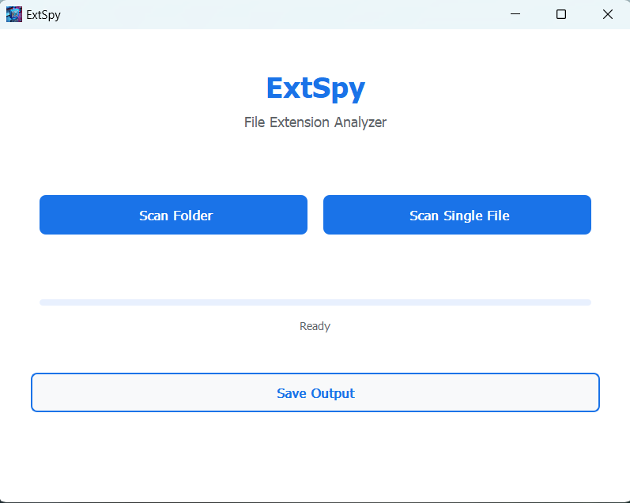

# ExtSpy - File Extension Analyzer

ExtSpy is a modern desktop application that helps you analyze file extensions in folders and individual files. Built with PyQt5, it provides a user-friendly interface for scanning and analyzing file extensions with detailed reporting capabilities.



## Features

- **Folder Scanning**: Analyze all files within a selected folder and its subfolders
- **Single File Analysis**: Examine individual files for detailed extension information
- **Progress Tracking**: Real-time progress bar showing scan status
- **Report Generation**: Save scan results to text files for future reference
- **Modern UI**: Clean, intuitive interface with smooth user experience

## Installation

### From Release
1. Download the latest release from the [Releases](https://github.com/kristenkamouh/ExtSpy/releases/tag/v2.0.0) page
2. Extract the ZIP file (if using One Directory version)
3. Run `ExtSpy.exe`

### From Source
1. Clone the repository:
```bash
git clone https://github.com/kristenkamouh/ExtSpy.git
cd extspy
```

2. Create and activate a virtual environment:
```bash
# Windows
python -m venv venv
venv\Scripts\activate

# macOS/Linux
python -m venv venv
source venv/bin/activate
```

3. Install dependencies:
```bash
pip install -r requirements.txt
```

4. Run the application:
```bash
python main.py
```

## Usage

1. **Scanning a Folder**
   - Click "Scan Folder"
   - Select the folder you want to analyze
   - Wait for the scan to complete
   - Save the results using the "Save Output" button

2. **Scanning a Single File**
   - Click "Scan Single File"
   - Select the file you want to analyze
   - Review the results
   - Save the analysis using the "Save Output" button

3. **Saving Results**
   - After completing a scan, click "Save Output"
   - Choose your save location
   - The results will be saved as a text file

## Building from Source

To create an executable:

1. Install auto-py-to-exe:
```bash
pip install auto-py-to-exe
```

2. Run auto-py-to-exe:
```bash
auto-py-to-exe
```

3. Configure the build:
   - Select `main.py` as the script location
   - Choose "One File" or "One Directory"
   - Set "Window Based" console option
   - Add the following hidden imports:
     - PyQt5
     - PyQt5.QtCore
     - PyQt5.QtGui
     - PyQt5.QtWidgets
   - Add icon and other resources in "Additional Files"

4. Click "Convert .py to .exe"

## Project Structure
```
ExtSpy/
├── main.py              # Application entry point
├── assets/             # Images and resources
│   └── extspy.png
│   └── extspy.ico
│   └── image.png       # for the github documentation
├── scanner/            # Scanner module
│   └── FileScanner.py
├── utils/              # Utility functions
│   └── FileOperation.py
├── ui/            # UI elements and butons
│   └── MainWindow.py
├── requirements.txt    # Project dependencies
└── README.md          # Documentation
```

## Requirements

- Python 3.8 or higher
- PyQt5
- Operating System: Windows 10/11

## Contributing

1. Fork the repository
2. Create a new branch: `git checkout -b feature-name`
3. Make your changes
4. Submit a pull request

## License

This project is licensed under the MIT License - see the [LICENSE](LICENSE) file for details.

## Author

Kristen Kamouh
- GitHub: [@kristenkamouh](https://github.com/kristenkamouh)

## Acknowledgments

- PyQt5 for the GUI framework
- Python community for various utilities and inspirations

## Support

For support, please open an issue in the [GitHub repository](https://github.com/kristenakamouh/extspy/issues).
